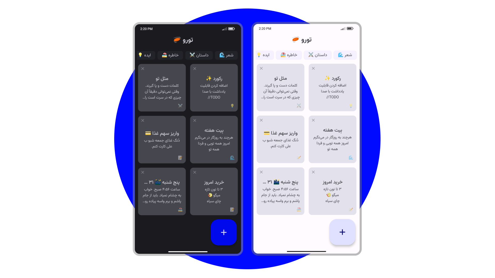

<div align="center">



```kotlin
architecture("Google's recommendation aka Clean") programmingLanguage("Kotlin")
uiToolkit("Jetpack Compose") async("Coroutines" + "Flow") localDatabase("Room")
dependencyInjection("Hilt")
``` 

</div>